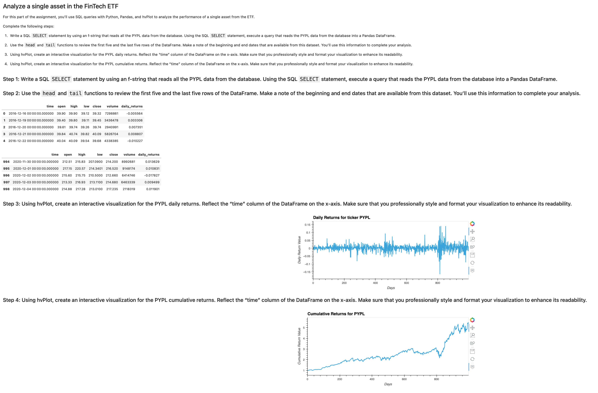
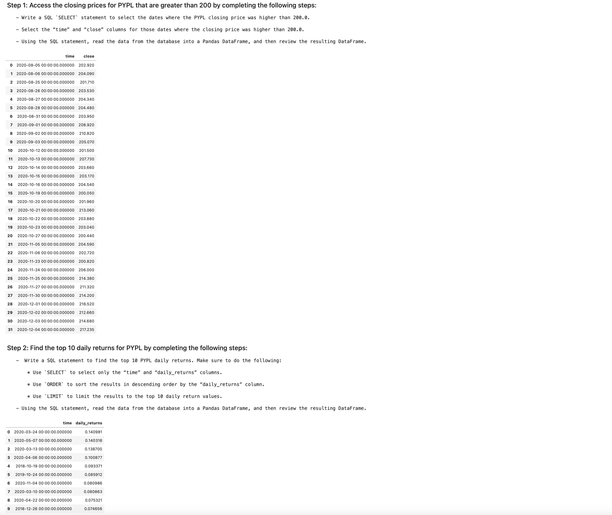
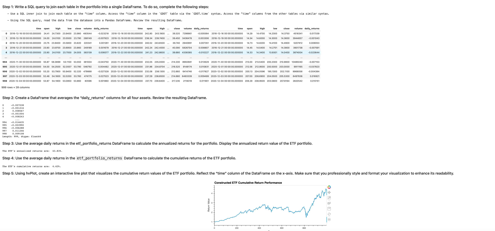
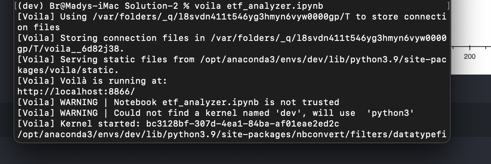

`ETF ANALYZER` -- **Passive investing** *means that you invest in a basket of assets that’s called an exchange-traded fund (ETF*)*. *This way, you don’t spend time researching individual stocks or companies or take the risk of investing in a single stock. ETFs offer more diversification*
*In this Challenge assignment, you’ll build a financial database and web application by using SQL, Python, and the Voilà library to analyze the performance of a hypothetical fintech ETF*.

[CLICK HERE](https://www.programiz.com/sql/database-introduction) to learn more about `DATABASE-SQL` 🧠

## `DATABASE-SQL`

# Step 1

Analyze a single asset in the ETF

# STEP 2 

 Optimize data access with advanced SQL queries
    

# STEP 3 
Analyze the ETF portfolio

# STEP 4

Deploy the notebook as a web application

[CLICK HERE](https://voila-gallery.org) to learn about voila

## REQUIRMENTS

[sqlalchemy](https://www.sqlalchemy.org)

[numpy](https://numpy.org)

[pandas](https://pandas.pydata.org)

## INSTALLATION

[ZIP FILE](https://github.com/brprod8/DEEP-LEARNING/archive/refs/heads/main.zip)

[CLONE REPO](https://github.com/brprod8/DEEP-LEARNING.git)

## LICENSE

**Open to Experiemnt**

BY:ROBERT SMITH

CREDIT: UC BERKELEY

EMAIL: ROBERTS.TRACK@YAHOO.COM